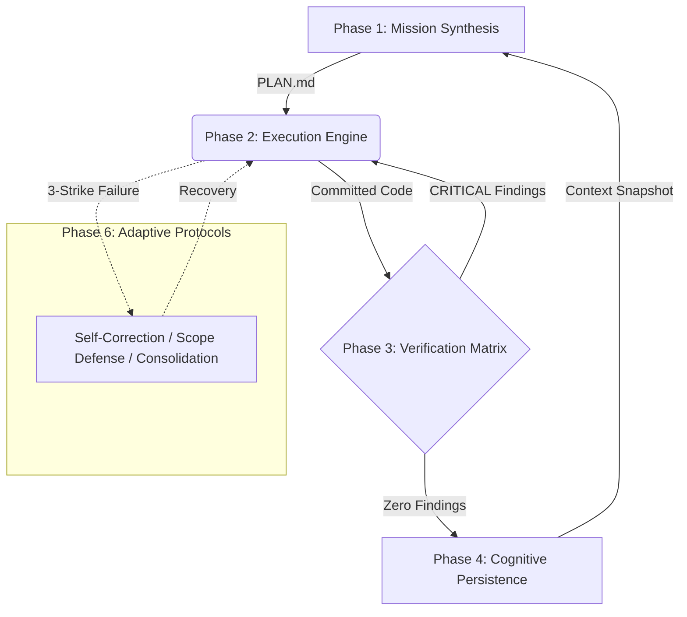

<div align="center">
  
# 🧠 Agentic Kernel

**A self-sufficient operating system for autonomous coding agents.**

[](https://opensource.org/licenses/MIT)
[](http://makeapullrequest.com)
[]()

*Stop watching your AI agent code itself into a corner. Give it discipline.*

[Quickstart](#-quickstart) •
[Architecture](#-architecture) •
[Supported Agents](#-supported-agents) •
[Contributing](#-contributing)

</div>

---

## 🚀 Why Agentic Kernel?

Most AI coding agents fail not because they lack intelligence, but because they lack **discipline**. When left to their own devices, they:
- ❌ Skip planning and jump straight to implementation.
- ❌ Write plausible-looking code that doesn't actually work.
- ❌ Get trapped in "doom loops" (fix-forward spirals).
- ❌ Forget what they learned between sessions (context amnesia).
- ❌ Suffer from "context rot" by loading too many instructions at once.

**Agentic Kernel solves this.** It provides a structured, multi-layer operating system—a set of mandatory protocols, verification gates, and anti-rationalization safeguards that force empirical discipline at every step.

---

## 🏗️ Architecture

The system is organized into a robust 3-tier hierarchy using **Progressive Disclosure** to prevent context window collapse.

### The 3-Tier Context Hierarchy

1. **L1: Apex Kernel (`SYSTEM_CORE.md`)** — Always-on routing and non-negotiable laws.
2. **L2: Phase Directors (`00_PHASE_DIRECTOR.md`)** — Just-in-time orchestration loaded only when entering a phase.
3. **L3: Skill Protocols (`skills/*.md`)** — Deep execution guidelines loaded *only* when requested by the Director.

### The Operational Loop



---

## 🛠️ The 6 Operational Phases

| Phase | Purpose | Key Skills |
| :--- | :--- | :--- |
| **01. Mission Synthesis** | Requirements & Planning | Requirement Distillation, Strategic Decomposition |
| **02. Execution Engine** | Implementation & Testing | Convergent Iteration, State Checkpointing |
| **03. Verification Matrix** | Quality & Review Gates | Pentagonal Audit, Entropy Reduction |
| **04. Cognitive Persistence** | Memory & Knowledge | Context Lifecycle, Structural Cartography |
| **05. Interface Protocols** | Safe Environment Interaction | Bounded Observation, Semantic Navigation |
| **06. Adaptive Protocols** | The Immune System | Recursive Self-Correction, Scope Containment |

---

## ⚡ Quickstart

Get Agentic Kernel working in your project in under 2 minutes.

### 1. Bootstrap Your Project

Run the installation script in your project root:

```bash
curl -sSL https://raw.githubusercontent.com/MeherBhaskar/agentic-kernel/main/install.sh | bash
```
*(Alternatively, clone this repo into an `.agents/` directory).*

### 2. Tell Your Agent to Start
Simply prompt your agent with:
> "I need to build [feature]. Read `.agents/SYSTEM_CORE.md` and begin Phase 1 (Mission Synthesis)."

The agent will automatically read the Phase 1 Director, create a `PLAN.md`, and orchestrate its own work through implementation, review, and context saving.

---

## 🤖 Supported Agents

Agentic Kernel is pure markdown and **platform-agnostic**. It works natively with:

<div align="center">
  
| Agent / IDE | Integration Method |
| :--- | :--- |
| **Cursor** | Point to `.agents/SYSTEM_CORE.md` in your `.cursorrules` or `.mdc` files. |
| **Claude Code** | Include a reference in your `CLAUDE.md`. |
| **GitHub Copilot** | Reference in `.github/copilot-instructions.md`. |
| **Gemini CLI / Antigravity**| Include in `.agents/AGENTS.md`. |
| **Aider** | Pass via `--read .agents/SYSTEM_CORE.md`. |

*See the [`examples/`](./examples) folder for ready-to-use configuration templates.*

</div>

---

## 🛡️ Core Philosophy

1. **Actionable Protocols** — Every instruction is a verifiable step with exit criteria, not an essay.
2. **Empirical Sovereignty** — Claims require evidence. "Seems right" is never sufficient.
3. **Atomic State Transitions** — The codebase moves between known-good states. Broken states are never committed.
4. **Anti-Rationalization** — Every skill actively anticipates and rebuts the excuses agents use to skip discipline.
5. **Progressive Disclosure** — The agent reads only the files it needs for the current phase, saving tokens and preventing instruction neglect.

---

## 🤝 Contributing

We welcome contributions to make agents smarter and more disciplined! 
Please see our [Contributing Guidelines](CONTRIBUTING.md) to understand how to design skills that agents actually follow.

---

<div align="center">
  If this framework saves your agent from a doom loop, consider leaving a ⭐!
</div>
