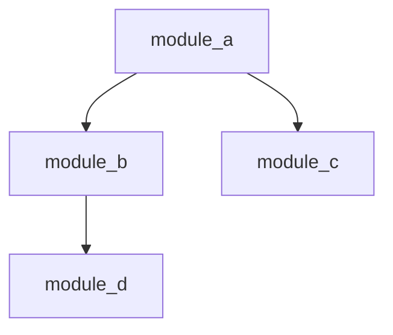

# Structural Cartography

> Maintain persistent, evolving architectural maps of the codebase that survive context resets and enable rapid orientation for any agent or session.

---

## Operational Protocol

### Phase 1: Initialize the Architecture Index

1. You MUST create `.docs/architecture/INDEX.md` if it does not exist. This is the root navigation document for the entire codebase.
2. Scan the repository's top-level directory structure and every significant subdirectory.
3. For every major module (directory containing related source files with a cohesive purpose), create a **Module Card** entry in `INDEX.md` using the format below.
4. Record the dependency relationships between modules. A dependency exists when module A imports, calls, or structurally relies on module B.
5. Generate a **Dependency Graph** in Mermaid syntax and embed it at the top of `INDEX.md`, immediately after the title.

### Phase 2: Build Module Cards

6. For each module, populate a card using this exact format:

```markdown
## Module: <name>
- **Purpose:** <one-line description of what this module does>
- **Key Files:** 
  - `file_a.py` — <brief description>
  - `file_b.py` — <brief description>
- **Dependencies:** <list of upstream modules this module imports from>
- **Dependents:** <list of downstream modules that import from this module>
- **Entry Points:** <public API functions, CLI commands, routes, or event handlers>
- **Last Verified:** <YYYY-MM-DD>
```

7. You MUST list actual files, not placeholders. If a module has more than 10 key files, list the 10 most important and note `(N additional files omitted)`.
8. Dependencies and Dependents MUST be bidirectionally consistent. If module A lists B as a dependency, module B MUST list A as a dependent.

### Phase 3: Build the Entry Point Catalog

9. Create `.docs/architecture/ENTRY_POINTS.md`.
10. For every user-facing feature or externally callable interface, document the **execution chain** from entry point to final output:

```markdown
### Feature: <name>
- **Entry:** `path/to/file.py:function_name` (line N)
- **Flow:** entry_function → validator → service_layer → repository → response
- **Key Branch Points:** <conditions that alter the flow>
- **Output:** <what gets returned/rendered/written>
```

11. Every chain MUST reference real file paths and real function names verified against the source.

### Phase 4: Build the Dependency Graph

12. Create a Mermaid graph in `.docs/architecture/INDEX.md` capturing all inter-module dependencies:



13. Direction of arrows MUST represent "depends on" (A → B means A depends on B).
14. Cluster tightly coupled modules using Mermaid subgraphs.

### Phase 5: Enforce Freshness

15. After every structural change (new module, moved file, changed dependency, altered public API), you MUST update the affected Module Cards, the Dependency Graph, and the Entry Point Catalog.
16. On every session start, check `Last Verified` dates. Any module card older than 48 hours is suspect — re-verify before trusting it.
17. When updating a Module Card, update the `Last Verified` field to today's date.
18. If you discover a Module Card references files or modules that no longer exist, delete the card immediately and note the removal in a `## Changelog` section at the bottom of `INDEX.md`.

---

## Update Triggers Checklist

You MUST update architecture documentation when ANY of the following occur:

| Trigger Event | Required Update |
|---|---|
| New module or package added | New Module Card + Dependency Graph update |
| Module deleted or renamed | Remove/rename Module Card + update all references |
| Dependency added or removed | Update both modules' cards + Dependency Graph |
| Entry point moved or renamed | Update Entry Point Catalog + affected Module Card |
| Public API signature changed | Update Module Card entry points |
| File moved between modules | Update both source and destination Module Cards |

---

## The 'New Developer' Test

After every major update to architecture docs, apply this test:

> Could someone with zero prior context about this project read `INDEX.md` and `ENTRY_POINTS.md` alone and correctly answer:
> 1. What does this system do?
> 2. Where is feature X implemented?
> 3. What depends on module Y?
> 4. How does a request flow from input to output?

If the answer to any question is "no," the documentation is incomplete. Fix it before proceeding.

---

## Anti-Rationalization Table

| Agent Excuse | Architectural Rebuttal |
|---|---|
| "The code is self-documenting, architecture docs are redundant." | Code reveals implementation, not intent or relationships. No one reads 50 files to understand a dependency graph. The map is not the territory, but you need a map. |
| "I'll update the docs after I finish this batch of changes." | Deferred updates become forgotten updates. Every structural change is an update trigger — not a suggestion, a requirement. Batch deferral is how staleness begins. |
| "The architecture hasn't changed much, the old docs are close enough." | 'Close enough' is the most dangerous state for architecture docs. A map that's 95% correct will lead you confidently into the 5% that's wrong. Stale maps are worse than no maps. |
| "Documenting every module is overkill for a small project." | Small projects become large projects. The cost of documenting 5 modules is trivial. The cost of reverse-engineering an undocumented 50-module system is catastrophic. |
| "I know the architecture from the current session context." | You know it. The next session does not. Context dies at session boundaries. Architecture docs are how knowledge survives agent mortality. |
| "Generating the Mermaid graph takes too long for a minor change." | If the change is structural, the graph is wrong until updated. A wrong graph is an active hazard. The cost of regeneration is measured in seconds; the cost of a misleading graph is measured in wasted hours. |

---

## Evidence Requirement

Execution of this skill is verified by the existence and correctness of these artifacts:

| Artifact | Location | Verification Check |
|---|---|---|
| Architecture Index | `.docs/architecture/INDEX.md` | Exists, contains Module Cards for every major module, includes Mermaid dependency graph |
| Entry Point Catalog | `.docs/architecture/ENTRY_POINTS.md` | Exists, every documented chain references real files and functions |
| Dependency Graph | Embedded in `INDEX.md` | Mermaid renders without errors, arrows are bidirectionally consistent with Module Cards |
| Last Verified Dates | Each Module Card | No card has `Last Verified` older than 48 hours without a re-verification note |
| Changelog | Bottom of `INDEX.md` | Records all structural changes with dates |

---

## Failure Modes

### 1. Aspirational Documentation
- **Symptom:** Docs describe how the system *should* work or *will* work, not how it *actually* works right now.
- **Detection:** Module Cards reference files that don't exist, functions that aren't implemented, or dependencies that aren't in `import` statements.
- **Recovery:** Audit every Module Card against `find` and `grep`. Remove anything not grounded in current source. Mark aspirational items with `[PLANNED]` and move them to a separate section.

### 2. Orphaned Documentation
- **Symptom:** Module Cards exist for modules that have been deleted or renamed.
- **Detection:** Cross-reference Module Card names against actual directory listing. Mismatch = orphan.
- **Recovery:** Delete orphaned cards. Update the Dependency Graph. Add removal to the Changelog.

### 3. Unidirectional Dependency Records
- **Symptom:** Module A lists B as a dependency, but Module B does not list A as a dependent (or vice versa).
- **Detection:** Script or manual audit comparing `Dependencies` and `Dependents` fields across all cards.
- **Recovery:** Reconcile both sides. The source code's actual `import` statements are the ground truth.

### 4. Entry Point Drift
- **Symptom:** Entry Point Catalog references functions that have been renamed, moved, or deleted.
- **Detection:** Grep for each documented function name in the codebase. Missing = drifted.
- **Recovery:** Re-trace the execution chain from the current entry point and update the catalog.

### 5. Over-Documentation Fog
- **Symptom:** INDEX.md is so long and detailed that finding information takes longer than reading the source code.
- **Detection:** INDEX.md exceeds 500 lines, or Module Cards document internal helper functions alongside public APIs.
- **Recovery:** Prune Module Cards to public-facing information only. Move detailed internal documentation to per-module `README.md` files and link from the card.

---

## Integration Points

| Skill | Relationship |
|---|---|
| **Context Lifecycle Management** | Architecture docs are a primary input for session resumption. The latest `INDEX.md` state is referenced in context snapshots. |
| **Source Verification** | Module Cards and Entry Point Catalogs must be verified against actual source code, not memory. Structural Cartography produces claims; Source Verification validates them. |
| **Decision Journaling** | Architectural decisions (why modules were structured a certain way) are recorded in the decision journal; the architecture index captures the *what*, the journal captures the *why*. |
| **Assumption Logging** | Any assumption about module boundaries or dependencies MUST be logged and verified before being committed to the architecture index. |
| **Error Triage** | The Dependency Graph enables rapid fault localization — when an error occurs, trace dependencies to identify the blast radius. |
